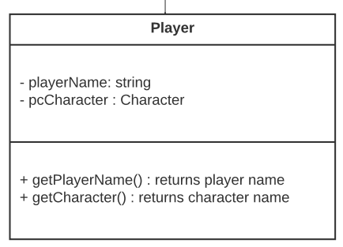
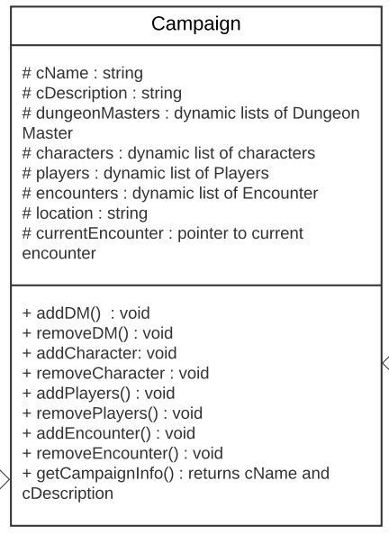
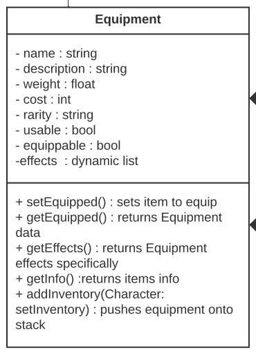
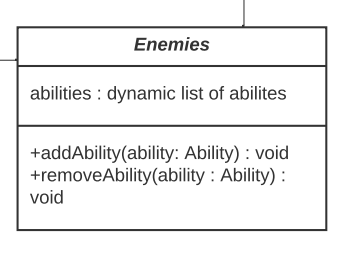
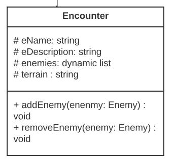
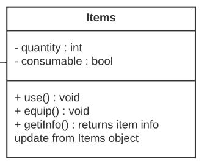
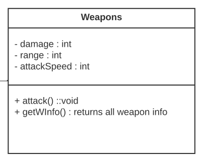
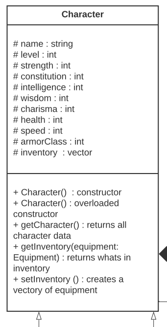

## A05 - UML Diagram
### Delton Hughes
### Description:

We are supposed to show the structure of an entire DnD game. Showing the classes that we think should be implemented with vairables and methods implemented in each.
the return types.

### Files

|   #   | File      | Description                      |
| :---: | --------- | -------------------------------- |
|   1   | README.md  | Info and assignment file.       |
|   2   | Banner.cpp| Banner uploaded.                 |                  

## Classes 

### Player

### Campaign

### Equipment

### Dungeon Master

### Enemies

### Encounter

### Items

### Weapons

### Character

